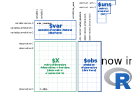

[](https://cran.r-project.org/package=anndata)
[](https://github.com/rcannood/anndata/actions)

# anndata - Annotated Data

[`anndata`](https://anndata.readthedocs.io/en/latest/) is a commonly
used Python package for keeping track of data and learned annotations,
and can be used to read from and write to the h5ad file format. It is
also the main data format used in the scanpy python package (Wolf,
Angerer, and Theis 2018).



However, using scanpy/anndata in R can be a major hassle. When trying to
read an h5ad file, R users could approach this problem in one of two
ways. A) You could read in the file manually (since it’s an H5 file),
but this involves a lot of manual work and a lot of understanding on how
the h5ad and H5 file formats work (also, expect major headaches from
cryptic hdf5r bugs). Or B) interact with scanpy and anndata through
reticulate, but run into issues converting some of the python objects
into R.

We recently published
[`anndata`](https://cran.r-project.org/package=anndata) on CRAN, which
is an R wrapper for the Python package – with some syntax sprinkled on
top to make R users feel more at home.

The R anndata is still under active development at
[github.com/rcannood/anndata](https://github.com/rcannood/anndata). If
you encounter any issues, feel free to post an issue on GitHub!

## Installation

Installing `anndata` is not particularly hard. You do need R and Python
to be installed. If you don’t have a working installation of Python, you
can let reticulate install Miniconda.

``` r
# install the R anndata package
install.packages("anndata")

# skip this if you wish to use the local python installation
reticulate::install_miniconda()

# skip this if anndata is already installed
anndata::install_anndata()
```

## Getting started

The API of `anndata` is very similar to its Python counterpart. Check
out `?anndata` for a full list of the functions provided by this
package.

`AnnData` stores a data matrix `X` together with annotations of
observations `obs` (`obsm`, `obsp`), variables `var` (`varm`, `varp`),
and unstructured annotations `uns`.

Here is an example of how to create an AnnData object with 2
observations and 3 variables.

``` r
library(anndata)

ad <- AnnData(
  X = matrix(1:6, nrow = 2),
  obs = data.frame(group = c("a", "b"), row.names = c("s1", "s2")),
  var = data.frame(type = c(1L, 2L, 3L), row.names = c("var1", "var2", "var3")),
  layers = list(
    spliced = matrix(4:9, nrow = 2),
    unspliced = matrix(8:13, nrow = 2)
  ),
  obsm = list(
    ones = matrix(rep(1L, 10), nrow = 2),
    rand = matrix(rnorm(6), nrow = 2),
    zeros = matrix(rep(0L, 10), nrow = 2)
  ),
  varm = list(
    ones = matrix(rep(1L, 12), nrow = 3),
    rand = matrix(rnorm(6), nrow = 3),
    zeros = matrix(rep(0L, 12), nrow = 3)
  ),
  uns = list(
    a = 1, 
    b = data.frame(i = 1:3, j = 4:6, value = runif(3)),
    c = list(c.a = 3, c.b = 4)
  )
)

ad
```

    ## AnnData object with n_obs × n_vars = 2 × 3
    ##     obs: 'group'
    ##     var: 'type'
    ##     uns: 'a', 'b', 'c'
    ##     obsm: 'ones', 'rand', 'zeros'
    ##     varm: 'ones', 'rand', 'zeros'
    ##     layers: 'spliced', 'unspliced'

You can read the information back out using the `$` notation.

``` r
ad$X
```

    ##    var1 var2 var3
    ## s1    1    3    5
    ## s2    2    4    6

``` r
ad$obs
```

    ##    group
    ## s1     a
    ## s2     b

``` r
ad$obsm[["ones"]]
```

    ##      [,1] [,2] [,3] [,4] [,5]
    ## [1,]    1    1    1    1    1
    ## [2,]    1    1    1    1    1

``` r
ad$layers[["spliced"]]
```

    ##    var1 var2 var3
    ## s1    4    6    8
    ## s2    5    7    9

``` r
ad$uns[["b"]]
```

    ##   i j     value
    ## 1 1 4 0.2655087
    ## 2 2 5 0.3721239
    ## 3 3 6 0.5728534

### Using scanpy

A nice side-effect of loading this package is that it is now super easy
to interact with scanpy through these AnnData objects.

``` r
library(reticulate)

ad$X
```

    ##    var1 var2 var3
    ## s1    1    3    5
    ## s2    2    4    6

``` r
sc <- import("scanpy")
sc$pp$normalize_per_cell(ad)

ad$X
```

    ##        var1 var2     var3
    ## s1 1.166667  3.5 5.833333
    ## s2 1.750000  3.5 5.250000

### Reading / writing AnnData objects

Read from h5ad format:

``` r
read_h5ad("example_formats/pbmc_1k_protein_v3_processed.h5ad")
```

    ## AnnData object with n_obs × n_vars = 713 × 33538
    ##     var: 'gene_ids', 'feature_types', 'genome', 'highly_variable', 'means', 'dispersions', 'dispersions_norm'
    ##     uns: 'hvgParameters', 'normalizationParameters', 'pca', 'pcaParameters'
    ##     obsm: 'X_pca'
    ##     varm: 'PCs'

### Creating a view

You can use any of the regular R indexing methods to subset the
`AnnData` object. This will result in a ‘View’ of the underlying data
without needing to store the same data twice.

``` r
view <- ad[, 2]
view
```

    ## View of AnnData object with n_obs × n_vars = 2 × 1
    ##     obs: 'group', 'n_counts'
    ##     var: 'type'
    ##     uns: 'a', 'b', 'c'
    ##     obsm: 'ones', 'rand', 'zeros'
    ##     varm: 'ones', 'rand', 'zeros'
    ##     layers: 'spliced', 'unspliced'

``` r
view$is_view
```

    ## [1] TRUE

``` r
ad[,c("var1", "var2")]
```

    ## View of AnnData object with n_obs × n_vars = 2 × 2
    ##     obs: 'group', 'n_counts'
    ##     var: 'type'
    ##     uns: 'a', 'b', 'c'
    ##     obsm: 'ones', 'rand', 'zeros'
    ##     varm: 'ones', 'rand', 'zeros'
    ##     layers: 'spliced', 'unspliced'

``` r
ad[-1, ]
```

    ## View of AnnData object with n_obs × n_vars = 1 × 3
    ##     obs: 'group', 'n_counts'
    ##     var: 'type'
    ##     uns: 'a', 'b', 'c'
    ##     obsm: 'ones', 'rand', 'zeros'
    ##     varm: 'ones', 'rand', 'zeros'
    ##     layers: 'spliced', 'unspliced'

### AnnData as a matrix

The `X` attribute can be used as an R matrix:

``` r
ad$X[,c("var1", "var2")]
```

    ##        var1 var2
    ## s1 1.166667  3.5
    ## s2 1.750000  3.5

``` r
ad$X[-1, , drop = FALSE]
```

    ##    var1 var2 var3
    ## s2 1.75  3.5 5.25

``` r
ad$X[, 2] <- 10
```

You can access a different layer matrix as follows:

``` r
ad$layers["unspliced"]
```

    ##    var1 var2 var3
    ## s1    8   10   12
    ## s2    9   11   13

``` r
ad$layers["unspliced"][,c("var2", "var3")]
```

    ##    var2 var3
    ## s1   10   12
    ## s2   11   13

### Note on state

If you assign an AnnData object to another variable and modify either,
both will be modified:

``` r
ad2 <- ad

ad$X[,2] <- 10

list(ad = ad$X, ad2 = ad2$X)
```

    ## $ad
    ##        var1 var2     var3
    ## s1 1.166667   10 5.833333
    ## s2 1.750000   10 5.250000
    ## 
    ## $ad2
    ##        var1 var2     var3
    ## s1 1.166667   10 5.833333
    ## s2 1.750000   10 5.250000

This is standard Python behaviour but not R. In order to have two
separate copies of an AnnData object, use the `$copy()` function:

``` r
ad3 <- ad$copy()

ad$X[,2] <- c(3, 4)

list(ad = ad$X, ad3 = ad3$X)
```

    ## $ad
    ##        var1 var2     var3
    ## s1 1.166667    3 5.833333
    ## s2 1.750000    4 5.250000
    ## 
    ## $ad3
    ##        var1 var2     var3
    ## s1 1.166667   10 5.833333
    ## s2 1.750000   10 5.250000

## Future work

In some cases, this package may still act more like a Python package
rather than an R package. Some more helper functions and helper classes
need to be defined in order to fully encapsulate `AnnData()` objects.
Examples are:

``` r
ad$chunked_X(1)
```

    ## <generator object AnnData.chunked_X at 0x7f68580674c0>

Following functionality has not been tested:

``` r
ad$rename_categories(...)
ad$strings_to_categoricals(...)
```

Currently not implemented are the `read_zarr()` and `ad$write_zarr()`
functions. I need some example data to test this functionality.

## Latest changes

Check out `news(package = "anndata")` or [NEWS.md](NEWS.md) for a full
list of changes.

<!-- This section gets automatically generated from NEWS.md -->

### Recent changes in anndata 0.7.5.1

-   MINOR CHANGE: Add wrapper classes for Raw and Layers objects.

-   MAJOR CHANGE: Calling `ad[..., ...]` now correctly returns a view of
    `ad` instead of returning a matrix.

-   TESTING: Extend tests based on `theislab/anndata` repository.

### Recent changes in anndata 0.7.5 (2020-11-19)

-   MINOR CHANGES: Updated Python requirements to anndata 0.7.5.

-   NEW FEATURE `AnnData()`: Added `obsp`, `varp`, and `raw` objects to
    parameters.

-   TESTING: Added more tests based on `theislab/anndata` repository.

## References

<div id="refs" class="references csl-bib-body hanging-indent">

<div id="ref-wolf_scanpylargescalesinglecell_2018" class="csl-entry">

Wolf, F Alexander, Philipp Angerer, and Fabian J Theis. 2018. “SCANPY:
Large-Scale Single-Cell Gene Expression Data Analysis.” *Genome Biology*
19 (February): 15. <https://doi.org/10.1186/s13059-017-1382-0>.

</div>

</div>
